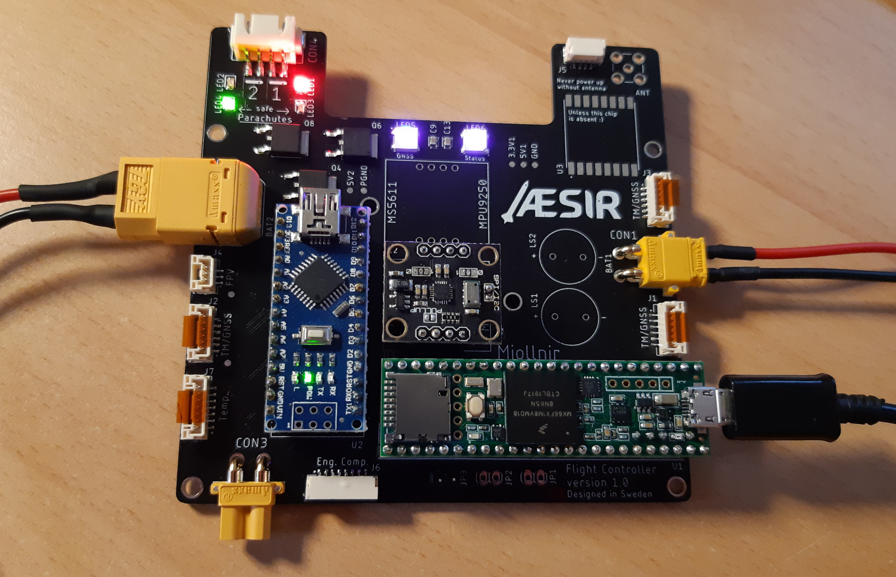

# Flight Controller <!-- omit in toc -->

This is the embedded software on the Flight Controller for the project Mjollnir. The Flight Controller is on-board the rocket. The Flight Controller communicates with the ground through a radio link during all phases of the flight

The mission objectives for the Mjollnir project relevant to the electronics are the following:

**Primary objectives**

- **E.PO.1** Monitor the rocket while it is on the launchpad and give a “Go”/”No go” signal
- **E.PO.2** Control the rocket while it is on the launchpad
- **E.PO.3** Trigger the drogue parachute’s ejection after apogee
- **E.PO.4** Trigger the main parachute’s ejection before touchdown
- **E.PO.5** Support rocket recovery operations
- **E.PO.6** Record video footage from the rocket

**Secondary objectives**

- **E.SO.1** Send real-time telemetry from the rocket
- **E.SO.2** Receive & display real-time telemetry from the rocket at the Ground Station as long as the rocket is at a reasonable distance
- **E.SO.3** Send real-time video from the rocket
- **E.SO.4** Receive & display real-time video from the rocket at the Ground Station as long as the rocket is at a reasonable distance
- **E.SO.5** Acquire flight data with more sensors than those deemed “mission-critical”
- **E.SO.6** Store all flight data on-board the rocket for further analysis

All of them apply to some extent to the Flight Controller



# Table of content <!-- omit in toc -->

- [Description](#description)
- [Data protocol](#data-protocol)
- [Folder structure](#folder-structure)

# Description

Two separate battery inputs are available on the Flight Controller

| Name | Voltage | Role                                                                              | Connector | Connector type |
|------|---------|-----------------------------------------------------------------------------------|-----------|----------------|
| BAT1 | 7.2V    | Power the sensors and low power chips                                             | CON1      | XT30, male     |
| BAT2 | 11.1V   | Power the EEDs for the parachutes, the Engine actuators, and the high power chips | CON2      | XT60, male     |

The Flight Controller has two microcontrollers

| Name              | Device       | Role                                                                                    | Power |
|-------------------|--------------|-----------------------------------------------------------------------------------------|-------|
| Main controller   | Teensy 3.6   | Handle the flight data acquisition, parachute ejection, Engine Computer and radio links | BAT1  |
| Backup controller | Arduino Nano | Eject the parachutes in case the main controller fails                                  | BAT2  |

A more detailed description of the hardware is given in [doc/hardware_description.md](doc/hardware_description.md)

# Data protocol

The protocol to communicate between the Ground Station and the Rocket is detailed in [doc/data-protocol](doc/data-protocol.md)

# Folder structure

```
.
├── doc/
│   ├── img/
│   ├── diagrams/
│   ├── sources
│   |   └── flight_controller_v1.0.pdf
│   ├── data-protocol.md
│   └── hardware_description.md
├── include/
│   └── hardware_definition_teensy.h
├── src/                                    // Code folder
│   └── test_companion_teensy.cpp
├── test/                                   // Unit tests
│   └── hardware_test_teensy.cpp
├── env_teensy.ini                          // Extra platformIO config
├── LICENSE
├── platformio.ini                          // PlatformIO config
└── README.md                               // This file
```