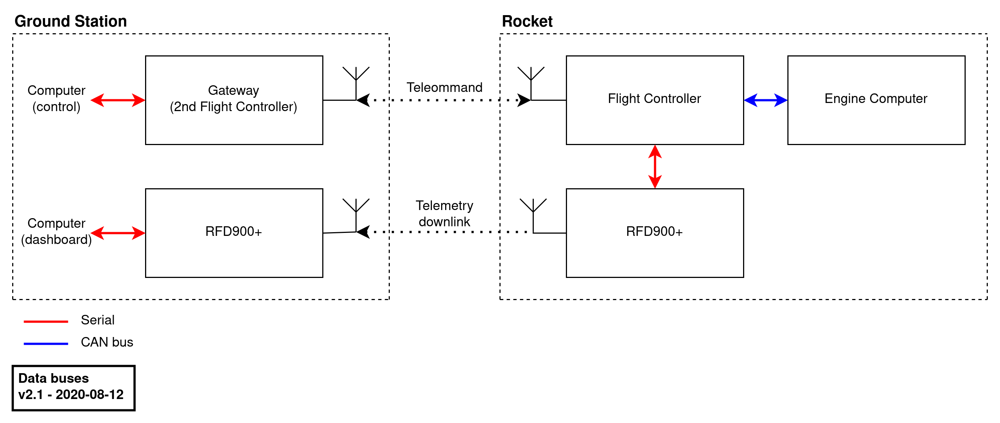
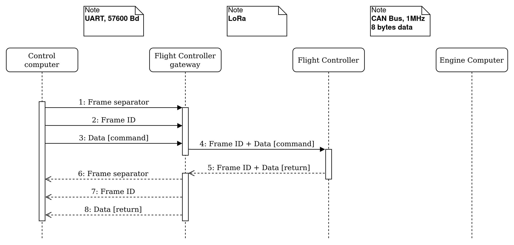
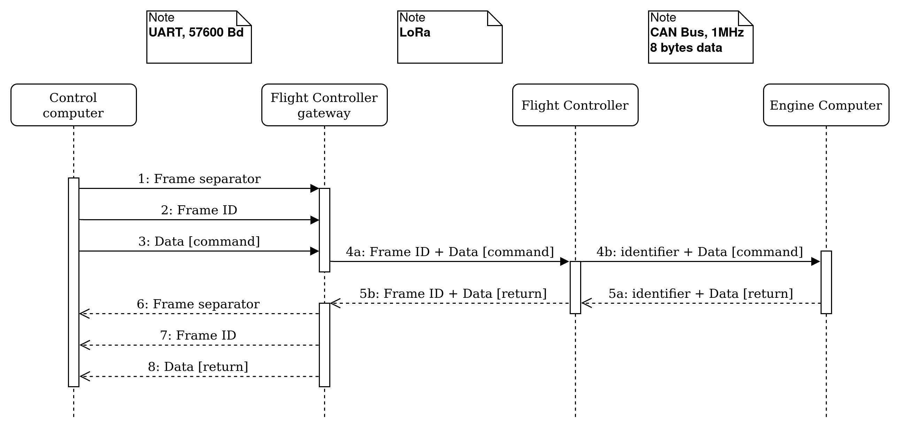
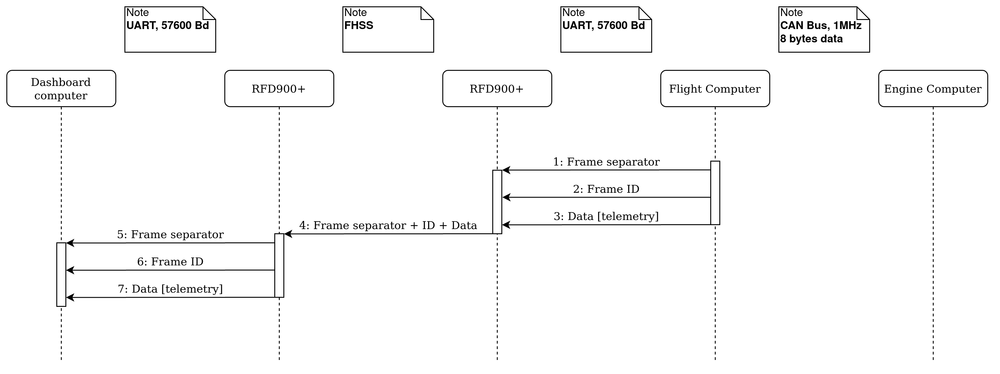
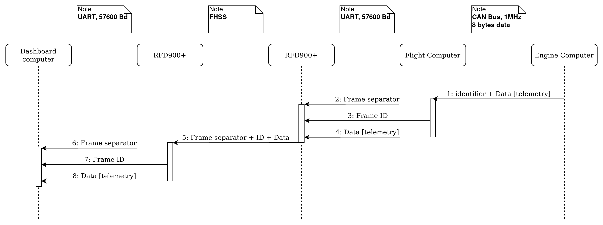

# Data Protocol <!-- omit in toc -->

Here is a description of the data protocol between the Rocket and the Ground Station for the Mjollnir project

# Table of contents <!-- omit in toc -->

- [Overview](#overview)
- [Development plan](#development-plan)
  - [Static Fire](#static-fire)
  - [Launch](#launch)
- [Serial links](#serial-links)
- [CAN Bus](#can-bus)
- [Data protocol](#data-protocol)
  - [Telecommand](#telecommand)
    - [Communication sequence](#communication-sequence)
    - [Commands description](#commands-description)
      - [Engine Controller](#engine-controller)
      - [Flight Controller](#flight-controller)
  - [Telemetry](#telemetry)
    - [Communication sequence](#communication-sequence-1)
    - [Data description](#data-description)

# Overview

>Overview of the data buses between the Ground Station and the Rocket 
The source file can be found in [doc/diagrams/data-buses.xml](diagrams/data-buses.xml)

The Gateway is connected to the Control computer through the USB connector of the Flight Controller 
The RFD900+ on the Ground Station side is connected to the Dashboard computer through an FTDI USB cable

The Flight Controller on the Ground Station 'Gateway' is a preliminary solution to have the Control computer talk to the Rocket's Flight Controller during the first static fire

# Development plan

The work on this data protocol is still preliminary. The development will be iterative and the first milestone is the static fire planned for the end of the summer 2020. The protocol will be refined later on to better allocate the telemetry sent back to the Ground Station.

## Static Fire

Drivers:

- Send commands to the Rocket and have the relevant ones forwarded to the Engine Computer
- Send back Telemetry to the Ground Station, mainly comprised of measurement samples from the Engine Computer
- No logic on the Flight Controller for the Telemetry packets, the packets are simply forwarded to the Ground Station

## Launch

Drivers:

- Maximize the amount of data downlinked from the Rocket, by optimizing how the data packets are processed by the Flight Controller and maybe also the Ground Station

# Serial links

All serial links share the same configuration. The baud rate is `57600`.

A frame on the serial links looks like this:

| Byte number | Description             |
| ----------- | ----------------------- |
| 0           | Frame separator: `0x0A` |
| 1           | Frame separator: `0x0D` |
| 2           | Frame ID                |
| 3           | Data byte 0             |
| 4           | Data byte 1             |
| [...]       | [...]                   |
| N+3         | Data byte N             |

The length of the data field is variable

# CAN Bus

> **Note:** the CAN bus between the Engine Computer and the Flight Controller can be extended to additional boards in future developments

CAN bus: CAN2.0 (FlexCAN) @1Mbit/s with termination 120$\Omega$ resistors on the Flight Controller side and on the Engine Computer side

Base frame format (11 identifier bits)

# Data protocol

The term `ID` is used below to denote `identifier field` of the CAN Bus and byte 2 (`Frame ID`) of a frame over the serial links

The `identifier field` is an 11 bits field but only the 8 lower bits are used to make the data on the CAN Bus as similar as possible to the data on the serial buses.

Each message on the Telecommand link and the Telemetry link has a unique ID

| ID              | Frame type | From              | To                |
|-----------------|------------|-------------------|-------------------|
| `0x00` - `0x0F` | TC         | Ground            | Engine Computer   |
| `0x10` - `0x1F` | TC         | Ground            | Flight Controller |
| `0x20` - `0x8F` | TM         | Engine Computer   | Ground            |
| `0x90` - `0xFF` | TM         | Flight Controller | Ground            |

## Telecommand

The Telecommand link is a low data rate radio link over LoRa at 433 MHz.

### Communication sequence

>Command sequence to the Rocket. Command addressed to the Flight Controller 
The source file can be found in [doc/diagrams/command-sequence.xml](diagrams/command-sequence.xml)

>Command sequence to the Rocket. Command addressed to the Engine Controller 
The source file can be found in [doc/diagrams/command-sequence.xml](diagrams/command-sequence.xml)

### Commands description

#### Engine Controller

*This part is stil undone...*

#### Flight Controller

Commands from the Ground Station to the Flight Controller

| ID     | Description             | Data size | Data                                                             | Comment                                                                                                            |
|--------|-------------------------|-----------|------------------------------------------------------------------|--------------------------------------------------------------------------------------------------------------------|
| `0x11` | Set sleeping mode       | 1 Byte    | bit0: `is_fc_sleeping`                                           | Default state is 0                                                                                                 |
| `0x12` | Enable radios emitters  | 1 Byte    | bit0: `is_fpv_en`   bit1: N/C   bit2: `is_tm_en`           | Default state is 0                                                                                                 |
| `0x13` | Enable parachute output | 1 Byte    | bit0: `is_armed`   bit1: `is_par1_en`   bit2: `is_par2_en` | Default state is 0   Used for testing only   Must set `is_armed` to 1 before a   parachute can be enabled |

Returned data

| ID     | Description              | Data size | Data                                                                                   | Comment                                        |
|--------|--------------------------|-----------|----------------------------------------------------------------------------------------|------------------------------------------------|
| `0x17` | Sleep mode               | 1 Byte    | bit0: `is_fc_sleeping`                                                                 | Returned after `0x11`                          |
| `0x18` | Radio emitters state     | 1 Byte    | bit0: `is_fpv_en`   bit1: N/C   bit2: `is_tm_en`                                 | Returned after `0x12`                          |
| `0x19` | Parachute outputs state  | 1 Byte    | bit0: `is_armed`   bit1: `is_par1_en`   bit2: `is_par2_en`                       | Returned after `0x13`                          |
| `0x1A` | On-board battery voltage | 4 Bytes   | byte0: `bat1_msb`   byte1: `bat1_lsb`   byte2: `bat2_msb`   byte3: `bat2_lsb` | Sent every `x` seconds   Unsigned, in 0.01V |
| `0x1B` | GNSS data                | -         | -                                                                                      | -                                              |
| `0x1C` | Software state           | -         | -                                                                                      | -                                              |

## Telemetry

The Telemetry link is a high data rate radio link over FHSS at 868 MHz. It is technicaly bi-directional but only the downlink capability is used.

### Communication sequence

>Telemetry sequence to the Rocket. Telemetry from the Flight Controller 
The source file can be found in [doc/diagrams/telemetry-sequence.xml](diagrams/telemetry-sequence.xml)

>Telemetry sequence to the Rocket. Telemetry from the Engine Controller 
The source file can be found in [doc/diagrams/telemetry-sequence.xml](diagrams/telemetry-sequence.xml)

### Data description

*This part is stil undone...*