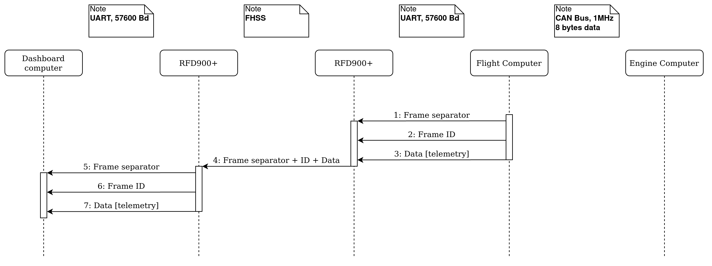

# Data Protocol <!-- omit in toc -->

Here is a description of the data protocol between the Rocket and the Ground Station for the Mjollnir project.

This protocol defines how Telecommands and Telemetry are transmitted between the Ground Station, the Engine Computer, and the Flight Controller.

The following repositories follow this data protocol:

- [aesirkth/flight-controller](https://github.com/aesirkth/flight-controller)
- [aesirkth/ground-control](https://github.com/aesirkth/ground-control)
- *engine computer repository*

The diagrams in this document can be edited using the online tool [diagrams.net](https://www.diagrams.net/). Just import the `.xml` files. Export the diagrams to `.png` and to `.xml` (compressed) and save them back here after modification.

The HTML tables in this document can be edited using the online tool [tablesgenerator.com](https://www.tablesgenerator.com/html_tables). Simply click "File / Paste table data" and paste the table. Make sure to check "Do not generate CSS" and uncheck "Compact mode".

# Table of contents <!-- omit in toc -->

- [Overview](#overview)
- [Development plan](#development-plan)
  - [Static Fire](#static-fire)
  - [Launch](#launch)
- [Serial links](#serial-links)
- [CAN Bus](#can-bus)
- [Data protocol](#data-protocol)
  - [Telecommand](#telecommand)
    - [Communication sequence](#communication-sequence)
    - [Commands description](#commands-description)
      - [Engine Controller](#engine-controller)
      - [Flight Controller](#flight-controller)
  - [Telemetry](#telemetry)
    - [Communication sequence](#communication-sequence-1)
    - [Data description](#data-description)
      - [Engine Controller](#engine-controller-1)
      - [Flight Controller](#flight-controller-1)
      - [About time stamps](#about-time-stamps)
      - [About lost frames](#about-lost-frames)

# Overview

>Overview of the data buses between the Ground Station and the Rocket 
The source file can be found in [doc/diagrams/data-buses.xml](diagrams/data-buses.xml) and edited using [diagrams.net](https://www.diagrams.net/) \[[desktop](https://github.com/jgraph/drawio-desktop/releases)]

The Gateway is connected to the Control computer through the USB connector of the Flight Controller 
The RFD900+ on the Ground Station side is connected to the Dashboard computer through an FTDI USB cable.

The Flight Controller on the Ground Station 'Gateway' is a preliminary solution to have the Control computer talk to the Rocket's Flight Controller during the first static fire.

# Development plan

The work on this data protocol is still preliminary. The development will be iterative and the first milestone is the static fire planned for the end of the beginning of 2021. The protocol will be refined later on to better allocate the telemetry sent back to the Ground Station.

## Static Fire

Drivers:

- Send commands to the Rocket and have the relevant ones forwarded to the Engine Computer
- Send back Telemetry to the Ground Station, mainly comprised of measurement samples from the Engine Computer
- No logic on the Flight Controller for the Telemetry packets, the packets are simply forwarded to the Ground Station. We will try to store the telemetry on the FC memory as well, so we can have data with higher sampling rates even if it is offline, as well as a backup.

## Launch

Drivers:

- Maximize the amount of data downlinked from the Rocket, by optimizing how the data packets are processed by the Flight Controller and maybe also the Ground Station.
- Be more resilient to loss of frames.

# Serial links

All serial links share the same configuration. The baud rate is `57600` (might need to be changed to 115200). The airspeed between the RFD900+ modems is 64kbps.

A frame on the serial links looks like this:

| Byte number | Description             |
| ----------- | ----------------------- |
| 0           | Frame separator: `0x0A` |
| 1           | Frame separator: `0x0D` |
| 2           | Frame ID                |
| 3           | Data byte 0             |
| 4           | Data byte 1             |
| [...]       | [...]                   |
| N+3         | Data byte N             |

The length of the data field is variable

# CAN Bus

> **Note:** the CAN bus between the Engine Computer and the Flight Controller can be extended to additional boards in future developments.

CAN bus: CAN2.0 (FlexCAN) @1Mbit/s with termination 120Ω resistors on the Flight Controller side and on the Engine Computer side.

Base frame format (11 identifier bits)

>**Note:** The Time Sync of the Engine Computer will be handled by the Flight Controller. The EC will send a request package and the FC will answer it using its currently configured system time (this can be the time set by the Ground Station or the time received through GNSS). 

# Data protocol

The term `ID` is used below to denote `identifier field` of the CAN Bus and byte 2 (`Frame ID`) of a frame over the serial links.

The `identifier field` is an 11 bits field but only the 8 lower bits are used to make the data on the CAN Bus as similar as possible to the data on the serial buses. The remaining `ID` values `100` - `7FF` are available for data transfer between on-board systems over the CAN Bus only, and cannot be sent to ground.

Each message on the Telecommand TC link and the Telemetry TM link has a unique ID.

<table>
<thead>
  <tr>
    <th>ID</th>
    <th>Frame Type</th>
    <th>From</th>
    <th>To</th>
    <th>Unique IDs</th>
  </tr>
</thead>
<tbody>
<tr>
    <td>0x00 - 0x3</td>
    <td>CAN</td>
    <td>Flight Controller</td>
    <td>Engine Controller</td>
    <td>4</td>
  </tr>
  <tr>
  <tr>
    <td>0x04 - 0x0F</td>
    <td>CAN</td>
    <td>Engine Controller</td>
    <td>Flight Controller</td>
    <td>12</td>
  </tr>
  <tr>
    <td>0x10 - 0x1F</td>
    <td>TC</td>
    <td>Ground Station</td>
    <td>Flight Controller</td>
    <td>16</td>
  </tr>
  <tr>
  <tr>
    <td>0x20 - 0x2F</td>
    <td>TC</td>
    <td>Flight Controller</td>
    <td>Ground Station</td>
    <td>16</td>
  </tr>
  <tr>
    <td>0x30 - 0x3F</td>
    <td>TC</td>
    <td>Ground Station</td>
    <td>Engine Computer</td>
    <td>16</td>
  </tr>
  <tr>
    <td>0x40 - 0x4F</td>
    <td>TC</td>
    <td>Engine Computer</td>
    <td>Ground Station</td>
    <td>16</td>
  </tr>
  <tr>
    <td>0x50 - 0x8F</td>
    <td>TM</td>
    <td>Flight Controller</td>
    <td>Ground Station</td>
    <td>64</td>
  </tr>
  <tr>
    <td>0x90 - 0xFF</td>
    <td>TM</td>
    <td>Engine Computer</td>
    <td>Ground Station</td>
    <td>112</td>
  </tr>
  </tr>
</tbody>
</table>

## Telecommand

The Telecommand link is a low data rate radio link over LoRa at 433 MHz. The communication will work on a request-response basis where the Ground Station sends a command and the Flight Controller or Engine Computer replies back, but at the same time some data will be streamed from the FC at a low rate.

### Communication sequence

>Command sequence to the Rocket. Command addressed to the Flight Controller 
The source file can be found in [doc/diagrams/command-sequence.xml](diagrams/command-sequence.xml) and edited using [diagrams.net](https://www.diagrams.net/) \[[desktop](https://github.com/jgraph/drawio-desktop/releases)]

>Command sequence to the Rocket. Command addressed to the Engine Controller 
The source file can be found in [doc/diagrams/command-sequence.xml](diagrams/command-sequence.xml) and edited using [diagrams.net](https://www.diagrams.net/) \[[desktop](https://github.com/jgraph/drawio-desktop/releases)]

### Commands description

ALL DATA MUST BE LITTLE-ENDIAN

#### Flight Controller

Commands sent from the Ground Station to the Flight Controller
<table>
<thead>
  <tr>
    <th>ID</th>
    <th>Description</th>
    <th>Data size</th>
    <th>Data</th>
    <th>Comment</th>
    <th>Rate</th>
  </tr>
</thead>
<tbody>
  <tr>
    <td>0x10</td>
    <td>Time Sync</td>
    <td>4</td>
    <td>system_time</td>
    <td>uint32_t, hhmmss.sss</td>
    <td> </td>
  </tr>
  <tr>
    <td>0x11</td>
    <td>Set Power Mode</td>
    <td>1</td>
    <td>TBD</td>
    <td> </td>
    <td> </td>
  </tr>
  <tr>
    <td>0x12</td>
    <td>Set Radio Equipment</td>
    <td>1</td>
    <td>bit0: is_fpv_en bit1: is_tm_en</td>
    <td>Default state is 0</td>
    <td> </td>
  </tr>
  <tr>
    <td>0x13</td>
    <td>Set Parachute Output</td>
    <td>1</td>
    <td>bit0: is_parachute_armed bit1: is_parachute1_en bit2: is_parachute2_en</td>
    <td>Default state is 0  Must set is_armed to 1 before a parachute can be enabled</td>
    <td> </td>
  </tr>
  <tr>
    <td>0x14</td>
    <td>Set Data Logging</td>
    <td>1</td>
    <td>bit0: is_logging_en</td>
    <td>enables data logging to SD-card and/or flash-chip</td>
    <td> </td>
  </tr>
  <tr>
    <td>0x15</td>
    <td>Dump flash chip</td>
    <td>1</td>
    <td>bit0: dump_sd  bit1: dump_usb</td>
    <td></td>
    <td> </td>
  </tr>
  <tr>
    <td>0x16</td>
    <td>handshake</td>
    <td>0</td>
    <td></td>
    <td></td>
    <td> </td>
  </tr>
</tbody>
</table>

Replies sent from the Flight Controller to the Ground Station and stremed data
<table>
<thead>
  <tr>
    <th>ID</th>
    <th>Description</th>
    <th>Data size</th>
    <th>Data</th>
    <th>Comment</th>
    <th>Rate</th>
  </tr>
</thead>
<tbody>
  <tr>
    <td>0x20</td>
    <td>Return Time Sync</td>
    <td>N/A</td>
    <td> </td>
    <td> </td>
    <td> </td>
  </tr>
  <tr>
    <td>0x21</td>
    <td>Return Power Mode</td>
    <td>1</td>
    <td>TBD</td>
    <td> </td>
    <td> </td>
  </tr>
  <tr>
    <td>0x22</td>
    <td>Return Radio Equipment</td>
    <td>1</td>
    <td>bit0: is_fpv_en bit1: is_tm_en</td>
    <td> </td>
    <td> </td>
  </tr>
  <tr>
    <td>0x23</td>
    <td>Return Parachute Output</td>
    <td>1</td>
    <td>bit0: is_parachute_armed bit1: is_parachute1_en bit2: is_parachute2_en</td>
    <td> </td>
    <td> </td>
  </tr>
  <tr>
    <td rowspan="2">0x24</td>
    <td rowspan="2">Onboard Battery Voltage</td>
    <td rowspan="2">4</td>
    <td>battery_1</td>
    <td>uint16_t, in 0.01V</td>
    <td rowspan="2">0.2</td>
  </tr>
  <tr>
    <td>battery_2</td>
    <td>uint16_t, in 0.01V</td>
  </tr>
  <tr>
    <td rowspan="5">0x25</td>
    <td rowspan="5">GNSS data</td>
    <td rowspan="5">15</td>
    <td>gnss_time</td>
    <td>uint32_t, in hhmmss.sss</td>
    <td rowspan="5">0.2</td>
  </tr>
  <tr>
    <td>latitude</td>
    <td>int32_t, in ddmm.mmmm</td>
  </tr>
  <tr>
    <td>longitude</td>
    <td>int32_t, in dddmm.mmmm</td>
  </tr>
  <tr>
    <td>h_dop</td>
    <td>uint16_t, in 0.01</td>
  </tr>
  <tr>
    <td>n_satellites</td>
    <td>uint8_t</td>
  </tr>
  <tr>
    <td rowspan="3">0x26</td>
    <td rowspan="3">Flight Controller Status</td>
    <td rowspan="3">3</td>
    <td>HW_state</td>
    <td>uint8_t</td>
    <td rowspan="3">0.2</td>
  </tr>
  <tr>
    <td>SW_state</td>
    <td>uint8_t</td>
  </tr>
  <tr>
    <td>mision_state</td>
    <td>uint8_t, enum</td>
  </tr>
  <tr>
    <td>0x27</td>
    <td>Return Data Logging</td>
    <td>1</td>
    <td>bit0: is_logging_en</td>
    <td> </td>
    <td> </td>
  </tr>
  <tr>
    <td>0x28</td>
    <td>Return dump flash</td>
    <td>1</td>
    <td>bit0: dump_sd  bit1: dump_usb</td>
    <td> </td>
    <td> </td>
  </tr>
  <tr>
    <td>0x29</td>
    <td>Return Handshake</td>
    <td>0</td>
    <td></td>
    <td> </td>
    <td> </td>
  </tr>
</tbody>
</table>

## Telemetry

The Telemetry link is a high data rate radio link over FHSS at 868 MHz. It is technically bi-directional but only the downlink capability is used.

### Communication sequence

>Telemetry sequence from the Rocket. Telemetry from the Flight Controller 
The source file can be found in [doc/diagrams/telemetry-sequence.xml](diagrams/telemetry-sequence.xml) and edited using [diagrams.net](https://www.diagrams.net/) \[[desktop](https://github.com/jgraph/drawio-desktop/releases)]

>Telemetry sequence from the Rocket. Telemetry from the Engine Controller 
The source file can be found in [doc/diagrams/telemetry-sequence.xml](diagrams/telemetry-sequence.xml) and edited using [diagrams.net](https://www.diagrams.net/) \[[desktop](https://github.com/jgraph/drawio-desktop/releases)]

### Data description

ALL DATA MUST BE LITTLE-ENDIAN
#### Flight Controller

<table>
<thead>
  <tr>
    <th>ID</th>
    <th>Description</th>
    <th>Data size</th>
    <th>Data</th>
    <th>Comment</th>
    <th>Tx Rate</th>
    <th>Sampling Rate</th>
  </tr>
</thead>
<tbody>
  <tr>
    <td>0x50</td>
    <td>Time since boot - millis</td>
    <td>4</td>
    <td>ms_since_boot</td>
    <td>uint32_t</td>
    <td> </td>
    <td></td>
  </tr>
  <tr>
    <td>0x51</td>
    <td>Time since boot - micros</td>
    <td>8</td>
    <td>us_since_boot</td>
    <td>uint64_t</td>
    <td> </td>
    <td></td>
  </tr>
  <tr>
    <td>0x52</td>
    <td>Current time</td>
    <td>4 </td>
    <td>current_time</td>
    <td>uint32_t, in hhmmss.sss interpolated from gps time</td>
    <td></td>
    <td></td>
  </tr>
  <tr>
    <td rowspan="3">0x53</td>
    <td rowspan="3">GNSS Data 1</td>
    <td rowspan="3">12</td>
    <td>gnss_time</td>
    <td>uint32_t, in hhmmss.sss</td>
    <td rowspan="3">2</td>
    <td rowspan="3">2</td>
  </tr>
  <tr>
    <td>latitude</td>
    <td>int32_t, in ddmm.mmmm</td>
  </tr>
  <tr>
    <td>longitude</td>
    <td>int32_t, in dddmm.mmmm</td>
  </tr>
  <tr>
    <td rowspan="6">0x54</td>
    <td rowspan="6">GNSS Data 2</td>
    <td rowspan="6">12</td>
    <td>altitude</td>
    <td>int32_t, in 0.1 meters</td>
    <td rowspan="6">2</td>
    <td rowspan="6">2</td>
  </tr>
  <tr>
    <td>heading</td>
    <td>int16_t, in degrees</td>
  </tr>
  <tr>
    <td>horiz_speed</td>
    <td>int16_t, in 0.1 km/h</td>
  </tr>
  <tr>
    <td>fix_status</td>
    <td>uint8_t, {0 = No Fix, 1 = 2D, 2 = 3D}</td>
  </tr>
  <tr>
    <td>n_satellites</td>
    <td>uint8_t</td>
  </tr>
  <tr>
    <td>h_dop</td>
    <td>uint16_t, in 0.1</td>
  </tr>
  <tr>
    <td rowspan="2">0x55</td>
    <td rowspan="2">Inside Static Temperature</td>
    <td rowspan="2">8</td>
    <td>temperature_1</td>
    <td>int32_t, in 0.01 ºC</td>
    <td rowspan="2">2</td>
    <td rowspan="2">TBD</td>
  </tr>
  <tr>
    <td>temperature_2</td>
    <td>int32_t, in 0.01 ºC</td>
  </tr>
  <tr>
    <td rowspan="2">0x56</td>
    <td rowspan="2">Inside Static Pressure</td>
    <td rowspan="2">8</td>
    <td>pressure_1</td>
    <td>int32_t, in 0.01 mbar</td>
    <td rowspan="2">20</td>
    <td rowspan="2">TBD</td>
  </tr>
  <tr>
    <td>pressure_2</td>
    <td>int32_t, in 0.01 mbar</td>
  </tr>
  <tr>
    <td rowspan="9">0x57</td>
    <td rowspan="9">IMU 1</td>
    <td rowspan="9">18</td>
    <td>accel_x</td>
    <td>int16_t</td>
    <td rowspan="9">20</td>
    <td rowspan="9">TBD</td>
  </tr>
  <tr>
    <td>accel_y</td>
    <td>int16_t</td>
  </tr>
  <tr>
    <td>accel_z</td>
    <td>int16_t</td>
  </tr>
  <tr>
    <td>gyro_x</td>
    <td>int16_t</td>
  </tr>
  <tr>
    <td>gyro_y</td>
    <td>int16_t</td>
  </tr>
  <tr>
    <td>gyro_z</td>
    <td>int16_t</td>
  </tr>
  <tr>
    <td>magnet_x</td>
    <td>int16_t</td>
  </tr>
  <tr>
    <td>magnet_y</td>
    <td>int16_t</td>
  </tr>
  <tr>
    <td>magnet_z</td>
    <td>int16_t</td>
  </tr>
  <tr>
    <td rowspan="9">0x58</td>
    <td rowspan="9">IMU 2</td>
    <td rowspan="9">18</td>
    <td>accel_x</td>
    <td>int16_t</td>
    <td rowspan="9">20</td>
    <td rowspan="9">TBD</td>
  </tr>
  <tr>
    <td>accel_y</td>
    <td>int16_t</td>
  </tr>
  <tr>
    <td>accel_z</td>
    <td>int16_t</td>
  </tr>
  <tr>
    <td>gyro_x</td>
    <td>int16_t</td>
  </tr>
  <tr>
    <td>gyro_y</td>
    <td>int16_t</td>
  </tr>
  <tr>
    <td>gyro_z</td>
    <td>int16_t</td>
  </tr>
  <tr>
    <td>magnet_x</td>
    <td>int16_t</td>
  </tr>
  <tr>
    <td>magnet_y</td>
    <td>int16_t</td>
  </tr>
  <tr>
    <td>magnet_z</td>
    <td>int16_t</td>
  </tr>
  <tr>
    <td rowspan="2">0x59</td>
    <td rowspan="2">External Temperature</td>
    <td rowspan="2">4</td>
    <td>temp_1</td>
    <td>int16_t</td>
    <td rowspan="2">10</td>
    <td rowspan="2">TBD</td>
  </tr>
  <tr>
    <td>temp_2</td>
    <td>int16_t</td>
  </tr>
  <tr>
    <td rowspan="2">0x5A</td>
    <td rowspan="2">Air Speed</td>
    <td rowspan="2">4</td>
    <td>pitot</td>
    <td>int16_t</td>
    <td rowspan="2">20</td>
    <td rowspan="2">TBD</td>
  </tr>
  <tr>
    <td>calculated</td>
    <td>int16_t</td>
  </tr>
  <tr>
    <td rowspan="2">0x5B</td>
    <td rowspan="2">Onboard Battery Voltage</td>
    <td rowspan="2">4</td>
    <td>battery_1</td>
    <td>uint16_t, in 0.01V</td>
    <td rowspan="2">2</td>
    <td rowspan="2">10</td>
  </tr>
  <tr>
    <td>battery_2</td>
    <td>uint16_t, in 0.01V</td>
  </tr>
  <tr>
    <td rowspan="3">0x5C</td>
    <td rowspan="3">Flight Controller Status</td>
    <td rowspan="3">3</td>
    <td>HW_state</td>
    <td>uint8_t bit0: is_parachute_armed bit1: is_parachute_1_en bit2: is_parachute_2_en bit3: is_fpv_en bit4: is_telemetry_en</td>
    <td rowspan="3">10</td>
    <td rowspan="3">10</td>
  </tr>
  <tr>
    <td>SW_state</td>
    <td>uint8_t</td>
  </tr>
  <tr>
    <td>mision_state</td>
    <td>uint8_t, enum</td>
  </tr>
</tbody>
</table>

#### About time stamps

The data acquisition process is the following:

1. Save all acquired data to a buffer
1. Sync the internal clock to GPS time and interpolate it
1. At a regular interval send the current time and the stored buffer
1. Every few seconds record the delays in the CAN-system
1. If needed use the delays to reconstruct the actual time on the ground station

This allows to reduce the overhead on the Telemetry link by only sending one time stamp for all the data acquired in one loop.
The error in acquisition time is acceptable as the sampling loop is assumed to be short with respect to the measured phenomena.
All the sensors may not be sampled in every loop or may be sampled without sending the samples to the ground. The sensors that require low sampling rates can simply be sampled and sent every **X** loop

#### About lost frames

Some cases might exist where the time frame is not received on the Ground Station.

On Sigmundr launch (2019), the telemetry frames were ~100 bytes long. It was noticed that when a failure occured, the whole frame was lost instead of just small bits at the beginning or so. **This has to do with how the RFD900+ modems handle the data transmission and should be further investigated.**

Possible mitigations for early uses of this protocol can be:

- Time stamp all packets at reception time and compare this time with the time frame.
- Assume no packet loss. (realistic at close range, < 1km with line of sight)
- Group the frames in a big packet (wait and send all at once) like was done on Sigmundr and hope for a pass / fail for one hole sampling loop.
