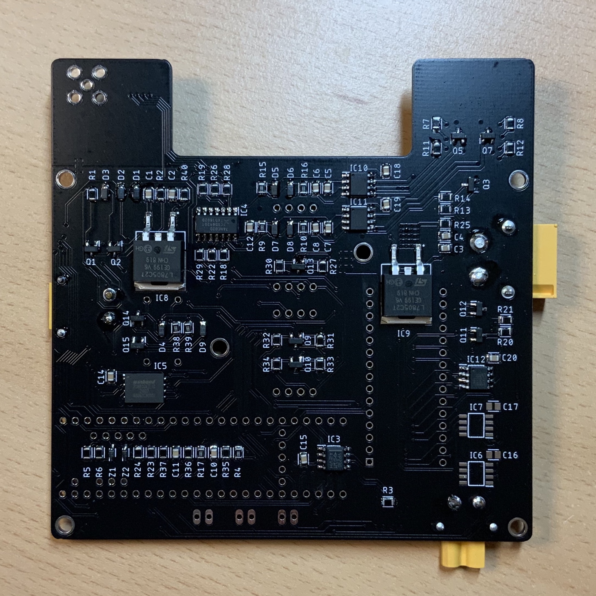

# Hardware description <!-- omit in toc -->

*This page describes the version 1.0 of the Flight Controller*

    
    

>Top side and bottom side of the Flight Controller PCB

The schematic of the Flight Controller is here [doc/sources/flight_controller_v1.0.pdf](sources/flight_controller_v1.0.pdf)

# Table of contents <!-- omit in toc -->

- [Microcontrollers](#microcontrollers)
- [Power](#power)
  - [Input](#input)
  - [Output](#output)
  - [Turn on the board](#turn-on-the-board)
  - [Power from USB](#power-from-usb)
- [Connectors](#connectors)

# Microcontrollers

The Flight Controller has two microcontrollers

| Name              | Device       | Role                                                                                    | Power |
| ----------------- | ------------ | --------------------------------------------------------------------------------------- | ----- |
| Main controller   | Teensy 3.6   | Handle the flight data acquisition, parachute ejection, Engine Computer and radio links | BAT1  |
| Backup controller | Arduino Nano | Eject the parachutes in case the main controller fails                                  | BAT2  |

# Power

## Input

Two separate battery inputs are available on the Flight Controller

| Name | Voltage | Role                                                                              | Connector | Connector type |
| ---- | ------- | --------------------------------------------------------------------------------- | --------- | -------------- |
| BAT1 | 7.2V    | Power the sensors and low power chips                                             | CON1      | XT30, male     |
| BAT2 | 11.1V   | Power the EEDs for the parachutes, the Engine actuators, and the high power chips | CON2      | XT60, male     |

## Output

| Voltage      | Role                | Connector | Connector type | Current rating |
| ------------ | ------------------- | --------- | -------------- | -------------- |
| Same as BAT2 | Power to the Engine | CON3      | XT30, female   | Up to 15A      |

## Turn on the board

Both batteries are required to use all the fonctions of the Flight Controller

The Flight Controller is ON when the signal `MS_SWITCH` is not tied to `GND` (internal pull-up).
When `MS_SWITCH` is (strongly) pulled down, all the power rails on the board are turned OFF.
The power output on `CON3` is also turned OFF.

`MS_SWITCH` is available on the following connectors :

- JP3
- J6

## Power from USB

Both microcontrollers have an USB input. Caution is required when using power battery power and the USB connection.

**Teensy 3.6**

The Teensy 3.6 board allows to physically isolate the `VIN` rail and the `VUSB` rail by cutting their respective pads apart.

Make sure to isolate `VIN` from `VUSB` on any Teensy used on the Flight Controller to avoid conflicts between the external supply and the usb supply.

    
    

**Arduino Nano**

The nano boards handles the power supply in a way that allows to use external power and USB power simultaneously. No modification is required.

# Connectors

    

